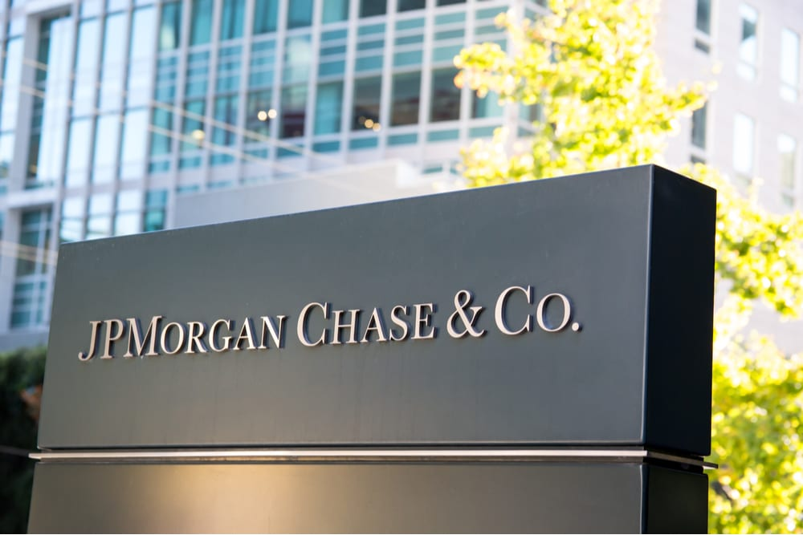

# *Case Study: JPMorgan Coin*

 

# **Overview and Origin**
## What is the name of the project?
Onyx – JPM’s Coin System helps address the complex challenges of cross-border payments, simplifies clients’ liquidity funding needs and offer next-generation corporate treasury services. JP Morgan Coin is the inaugural product solution, which is a digital token used for payment settlement.
JPM Coin, leveraging the Coin System, has the capability to support advanced payment types like DvP (Delivery versus Payment), PvP (Payment versus Payment) as well as machine-to-machine payments. 
## When was the project incorporated?
Febuary 2019.
## Who are the founders of the parent company?
JPMorgan was founded by Aaron Burr, Balthazar P. Melick, John Pierpont Morgan and John Thompson in December 2000. 
## How did the idea for the project come about?
Even though a few years back, the CEO of JPMorgan Chase, Jamie Dimon, had bashed bitcoin and even mocked his own daughter for investing in cryptocurrency, it now became known to the world that JPMorgan “has a master plan all along” – JPMorgan revealed its plans for JPM Coin, which is a cryptocurrency that is connected to the U.S. dollars stored in JPMorgan Chase account. JPMorgan also claimed that ultimately, they believe JPM Coin can yield significant benefits by “reducing clients’ counterparty and settlement risk, decreasing capital requirements and enabling instant value transfer”.
The idea for JPM Coin was sparked after JP Morgan joined the distributed ledger consortium R3 in 2015 and launched Quorum (which is inspired by the Ethereum blockchain that is publicly available) a year later. 

# **Business Activities**

## What specific financial problem is the company or project trying to solve?
JPM Coin was created for two main purposes – to settle large-volume payments between JPMorgan Chase (JPMC) and other financial institutions and to improve payment settlement between JPMC customers. JPM Coin works in a similar way to stablecoins, that is, it is only available to JPMC customers and cannot be transacted like normal digital assets such as bitcoin. 
## Who is the company's intended customer?  Is there any information about the market size of this set of customers?
Initially, the cryptocurrency is only available to be used internally between JPMorgan Chase’s wholesale business clients to transfer funds in a faster way than relying on the traditional Swift interbank messaging system.
## What solution does this company offer that their competitors do not or cannot offer? 
JPMorgan Chase is the first major U.S. bank to issue cryptocurrency (stablecoins) as a means of payment to its clients, while the product they release, JPM Coin, is also the latest, the most high-profile launch of stablecoins. 
## Which technologies are they currently using, and how are they implementing them? 
The main technology used by JPMorgan Chase in developing JPMCoin is blockchain. JPMorgan Chase had not only invested in the blockchain intelligence company TRM Labs but had also launched its own blockchain consortium called Interbank Information Network (INN).

# **Landscape**

## What domain of the financial industry is the company in?
Financial services
## What have been the major trends and innovations of this domain over the last 5–10 years?
The major trends in financial services are 1) open banking 2) cloud-native systems 3) artificial intelligence (AI) and machine learning (ML) and 4) cybersecurity. The major financial innovations over the past years are 1) PayPal, the current biggest online payment processor 2) Funding Circle, the platform that connects organizations that have available cash with creditworthy companies that seek financing 3) M-Pesa, the largest payment platform in Africa and 4) WeChat, one of the world’s most popular and independent mobile apps through monthly active users.
## What are the other major companies in this domain?
Top 15 companies in the financial services industry besides JPMorgan Chase are: Berkshire Hathaway, Fannie Mae, Bank of America, Citigroup, Wells Fargo, State Farm, Metropolitan Life Insurance Company, Freddie Mac, Prudential Financial, Brookfield Asset Management, Morgan Stanley, PrimeLending, Edward Jones and Pinnacle Financial Partners.

# **Results**

## What has been the business impact of this company so far?
The digital token designed to facilitate JPMorgan Chase’s various cross-border monetary transactions has the potential to save the global finance industry hundreds of millions of dollars in peripheral costs such as processing charges and high tax fees. The launch of JPM Coin is also a signal that blockchain and crypto technology are ready to be applied for prime-time, industrialized use and generate returns for the users. It also helps more enterprises get comfortable with operating businesses on-chain with crypto and blockchain technology.

## What are some of the core metrics that companies in this domain use to measure success? How is your company performing, based on these metrics?
Some of the key financial metrics for measuring success are 1) Profitability KPIs, such as gross profit margin and net profit margin 2) Liquidity KPIs, such as current ratio and quick ratio 3) Efficiency KPIs, such as inventory turnover and accounts receivable turnover 4) Valuation KPIs, such as earnings per share and price to earnings ratio and 5) Leverage KPIs, such as debt to equity and return on equity. JPMC was very successful based on these metrics and has a strong growth profile: over the past five years, JPMorgan has grown revenue by 7% compounded annually and core earnings by 11% compounded annually. The firm was able to increase its core earnings margin year-over-year (YoY) in 8 of the past 10 years and has increased from less than 11% in 2009 to 23% TTM.

# **Recommendations**

## If you were to advise the company, what products or services would you suggest they offer? 
I would recommend providing services related to cybersecurity as it is one of the top trends in the industry and also is related to the digital token (JPM Coin) developed by JPMC.
## Why do you think that offering this product or service would benefit the company?
Since trust has been one of the most important things valued by customers in the financial services industry, financial services firms are encouraged to win and preserve the trust of customers, and dedicate to preserving confidentiality, confirming the availability of systems and services, and maintaining the integrity of data. In strengthening the relationship between the firm and customers, the firm will be able to make more profit and operate more stably.
## What technologies would this additional product or service utilise?
This additional technology would utilize technologies such as machine learning, artificial intelligence, blockchain, cloud computing, intrusion prevention system and intrusion detection system and so on.

# **References**
* https://en.wikipedia.org/wiki/JPMorgan_Chase
* https://crypto.marketswiki.com/index.php?title=JPM_Coin
* https://www.pymnts.com/tag/jpm-coin/
* https://www.jpmorgan.com/onyx/coin-system.htm
* https://www.forbes.com/sites/michaeldelcastillo/2019/02/14/jaime-dimon-finally-shows-jp-morgans-cryptocurrency-hand/?sh=59ff90f72e7e 
* https://blockworks.co/news/jpmorgan-chase-strategically-invests-in-blockchain-focused-trm-labs 
* https://www.receeve.com/blog/top-5-trends-in-2022 
* https://www.getsmarter.com/blog/market-trends/4-examples-of-financial-innovations/ 
* https://cointelegraph.com/news/jpm-coin-debut-marks-start-of-blockchain-s-value-driven-adoption-cycle 
* https://www.forbes.com/sites/greatspeculations/2020/06/11/bank-on-the-best-jpmorgan-chase--company/ 
* https://www.ey.com/en_au/innovation-financial-services/cybersecurity 
* https://hkrtrainings.com/cyber-security-technologies 
* https://www.netsuite.com/portal/resource/articles/accounting/financial-kpis-metrics.shtml
* https://www.linkedin.com/pulse/15-largest-companies-finance-field-get-ahead-by-linkedin-news

